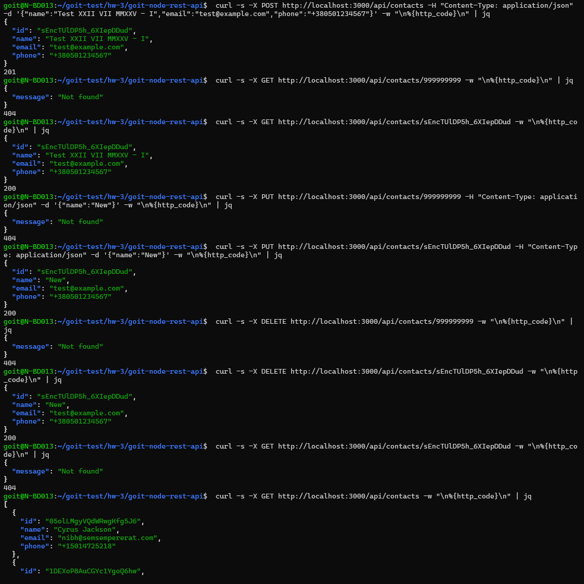

# goit-node-rest-api

[](https://github.com/andriy-pro/goit-node-rest-api/actions/workflows/ci.yml)
[](https://www.gnu.org/licenses/gpl-3.0)
[](https://nodejs.org/)
[](https://www.npmjs.com/)
[](https://expressjs.com/)
[](https://helmetjs.github.io/)

Repository for the homework solution from the GoIT course 'Fullstack. Back End Development: Node.js', Topic 4: REST API.

---

# **Домашнє завдання. Тема 4. REST API**

Написати REST API для роботи з колекцією контактів. Для роботи з REST API використовуй [Postman](https://www.getpostman.com/).

## Крок 1

- Створи репозиторій з назвою `goit-node-rest-api` і помісти на головну гілку (`main`) файли з папки [src](https://github.com/goitacademy/neo-nodejs-homework/tree/main/hw2). Зауваж: папки `src` в репозиторії бути не повинно, тебе цікавить лише її вміст.
- Створи гілку `hw02-express` з гілки `main`.
- Встанови модулі командою

```bash
npm i
```

## Крок 2

У файл `contactsServices.js` (знаходиться в папці `services`) скопіюй функції з файла `contacts.js` з домашнього завдання до модуля 1.

## Крок 3

Напиши контролери у файлі `contactsControllers.js` (знаходиться у папці `controllers`) з урахуванням наведених нижче вимог.

**REST API повинен підтримувати такі раути:**

### GET /api/contacts

- Викликає функцію-сервіс `listContacts` для роботи з json-файлом `contacts.json`
- Повертає масив всіх контактів в json-форматі зі статусом `200`

### GET /api/contacts/:id

- Викликає функцію-сервіс `getContactById` для роботи з json-файлом `contacts.json`
- Якщо контакт за `id` знайдений, повертає об'єкт контакту в json-форматі зі статусом `200`
- Якщо контакт за `id` не знайдено, повертає json формату `{"message": "Not found"}` зі статусом `404`

### DELETE /api/contacts/:id

- Викликає функцію-сервіс `removeContact` для роботи з json-файлом `contacts.json`
- Якщо контакт за `id` знайдений і видалений, повертає об'єкт видаленого контакту в json-форматі зі статусом `200`
- Якщо контакт за `id` не знайдено, повертає json формату `{"message": "Not found"}` зі статусом `404`

### POST /api/contacts

- Отримує `body` в json-форматі з полями `{name, email, phone}`. Усі поля є обов'язковими - для валідації створи у файлі `contactsSchemas.js` (знаходиться у папці `schemas`) схему з використанням пакета `joi`
- Якщо в `body` немає якихось обов'язкових полів (або передані поля мають не валідне значення), повертає json формату `{"message": error.message}` (де `error.message` - змістовне повідомлення з суттю помилки) зі статусом `400`
- Якщо `body` валідне, викликає функцію-сервіс `addContact` для роботи з json-файлом `contacts.json`, з передачею їй даних з `body`
- За результатом роботи функції повертає новостворений об'єкт з полями `{id, name, email, phone}` і статусом `201`

### PUT /api/contacts/:id

- Отримує `body` в json-форматі з будь-яким набором оновлених полів (`name`, `email`, `phone`) (всі поля вимагати в боді як обов'язкові не потрібно: якщо якесь із полів не передане, воно має зберегтись у контакта зі значенням, яке було до оновлення)
- Якщо запит на оновлення здійснено без передачі в `body` хоча б одного поля, повертає json формату `{"message": "Body must have at least one field"}` зі статусом `400`
- Передані в боді поля мають бути провалідовані - для валідації створи у файлі `contactsSchemas.js` (знаходиться у папці `schemas`) схему з використанням пакета `joi`. Якщо передані поля мають не валідне значення, повертає json формату `{"message": error.message}` (де `error.message` - змістовне повідомлення з суттю помилки) зі статусом `400`
- Якщо з `body` все добре, викликає функцію-сервіс `updateContact`, яку слід створити в файлі `contactsServices.js` (знаходиться в папці `services`). Ця функція має приймати `id` контакта, що підлягає оновленню, та дані з `body`, і оновити контакт у json-файлі `contacts.json`
- За результатом роботи функції повертає оновлений об'єкт контакту зі статусом `200`
- Якщо контакт за `id` не знайдено, повертає json формату `{"message": "Not found"}` зі статусом `404`

---

> **Зверни увагу**
>
> - Валідацію `body` можна як здійснювати у контролері, так і створити для цих цілей окрему міддлвару, яка буде викликатись до контролера. Для створення міддлвари можеш скористатись функцією `validateBody.js`, яку знайдеш у папці `helpers`
> - Для роботи з помилками можна скористатись функцією `HttpError.js`, яку знайдеш у папці `helpers`

---

## Особливості даної реалізації

- **Test-Driven Development (TDD):**

  - Розробка велася за методологією TDD - спочатку тести, потім реалізація.
  - Комплексна тестова база з 23 тестами, що покривають всі CRUD операції та валідацію.
  - Тести для сервісів (`tests/services/contactsServices.test.js`) та схем валідації (`tests/schemas/contactsSchemas.test.js`).
  - Налаштований Jest для роботи з ES модулями та генерації звітів покриття коду.

- **Централізована обробка помилок:**

  - Кастомний клас `HttpError` з правильними HTTP статус-кодами для production-ready застосунку.
  - Централізована обробка помилок в Express.js з middleware для обробки всіх типів помилок.
  - Структуровані повідомлення про помилки з детальним описом проблеми для розробників та користувачів.

- **Безпека HTTP заголовків (Helmet):**

  - Інтегрований Helmet middleware для захисту HTTP заголовків.
  - Автоматичне налаштування заголовків безпеки: Content-Security-Policy, X-Frame-Options, X-XSS-Protection.
  - Приховування заголовка `X-Powered-By` для безпеки в production.
  - Захист від XSS атак, clickjacking та інших векторів атак.

- **Професійна валідація з Joi:**

  - Валідація всіх вхідних даних з використанням Joi - індустріального стандарту для Node.js.
  - Сучасна валідація телефонних номерів у форматі E.164 (міжнародний стандарт) з regex `/^\+[1-9]\d{6,14}$/`.
  - Гнучкі схеми валідації з кастомними повідомленнями про помилки українською мовою.
  - Окремі схеми для створення (`createContactSchema`) та оновлення (`updateContactSchema`) контактів.

- **Професійні middleware та логування:**

  - Використання `morgan` для HTTP логування запитів у development режимі.
  - CORS middleware для підтримки крос-доменних запитів.
  - Middleware для валідації тіла запиту (`validateBody`) з інтеграцією Joi схем.
  - Обробка JSON запитів з `express.json()` middleware.

- **Документований код з JSDoc:**

  - Весь код містить детальні JSDoc коментарі з описом параметрів, типів та прикладів використання.
  - Функції мають описи призначення, параметрів та повертаних значень.
  - Приклади використання для складних функцій, доступні навіть для junior-розробників.

---

## 📚 Документація проєкту

### 🚀 Швидкий старт

#### Передумови

- Node.js 18.0 або вище
- npm 8.0 або вище

#### Встановлення та запуск

1. **Клонування репозиторію:**

   ```bash
   git clone https://github.com/your-username/goit-node-rest-api.git
   cd goit-node-rest-api
   ```

2. **Встановлення залежностей:**

   ```bash
   npm install
   ```

3. **Запуск сервера розробки:**

   ```bash
   npm run dev
   ```

4. **Перевірка роботи API:**

   ```bash
   curl http://localhost:3000/api/contacts
   ```

### 📱 Postman тестування

Проєкт включає професійну Postman колекцію для комплексного тестування API:

#### 🚀 Швидкий старт з Postman

1. **Імпорт колекції:**

   ```bash
   # Відкрийте Postman → Import →
   docs/postman-collection.json
   ```

2. **Налаштування середовища:**
   - Створіть Environment `GoIT Local`
   - Встановіть `baseUrl = http://localhost:3000`
   - Активуйте середовище

3. **Запуск тестів:**
   - **Послідовно**: Запускайте запити по одному
   - **Collection Runner**: Всі тести з затримкою 500ms

#### 🎯 Покриття тестів

- **33 автоматичних тести** ✅
- **100% CRUD операцій**
- **Валідація E.164 телефонів**
- **Обробка помилок (404, 400)**
- **CORS та security headers**

---

## 🖥️ Приклад результатів тестових команд

Нижче наведено скріншот з консолі, що демонструє коректну роботу API при виконанні тестових запитів (GET, POST, PUT, DELETE):



- Всі статуси та повідомлення відповідають вимогам.
- Відображено роботу з неіснуючими ID, валідацію, обробку 404 та успішні запити.
