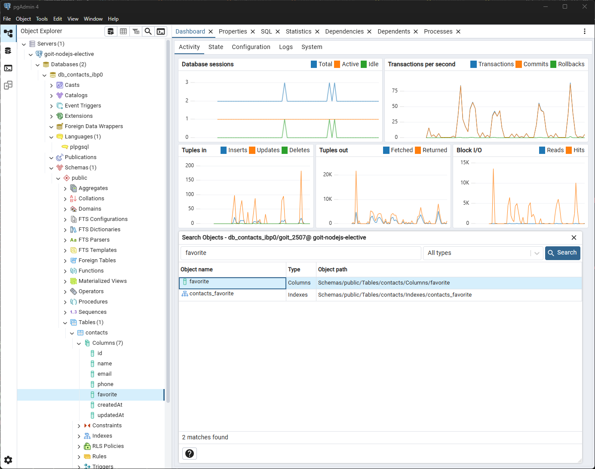
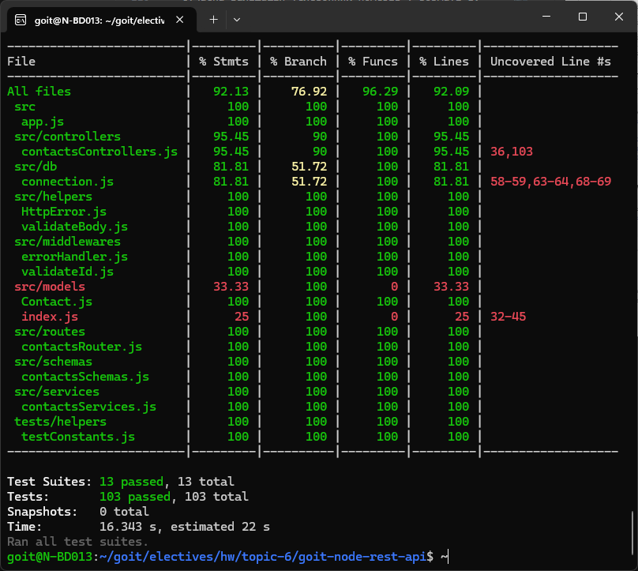

# goit-node-rest-api

[](https://nodejs.org/)
[](https://www.npmjs.com/)
[](https://sequelize.org/)
[](https://www.postgresql.org/)
[](https://jestjs.io/)
[](https://nodejs.org/api/esm.html)
[](https://www.npmjs.com/package/dotenv)

Repository for the homework solution from the GoIT course 'Fullstack. Back End
Development: Node.js', Topic 6: PostgreSQL and Sequelize.

---

# **Домашнє завдання. Тема 6. PostgreSQL та Sequelize**

Створи гілку `03-postgresql` з гілки `master`.

Продовж створення REST API для роботи з колекцією контактів.

## Крок 1

- Створи акаунт на [Render](https://render.com/). Після чого в акаунті створи
  нову базу даних PostgreSQL, яку треба назвати `db-contacts`.

## Крок 2

- Встанови графічний редактор [pgAdmin](https://www.pgadmin.org/download/) для
  зручної роботи з базою даних для PostgreSQL. Підключись до створеної хмарної
  бази через графічний редактор та створи таблицю `contacts`.

## Крок 3

Використовуй вихідний код домашньої роботи #2 і заміни зберігання контактів з
json-файлу на створену тобою базу даних.

- Напиши код для створення підключення до PostgreSQL за допомогою
  [Sequelize](https://www.npmjs.com/package/sequelize).
- При успішному підключенні виведи в консоль повідомлення
  `"Database connection successful"`.
- Обов'язково обробив помилку підключення. Виведи в консоль повідомлення помилки
  і заверши процес використовуючи `process.exit(1)`.
- У функціях обробки запитів заміни код CRUD-операцій над контактами з файлу, на
  Sequelize-методи для роботи з колекцією контактів в базі даних.

### Sequelize-модель `contacts`

```js
const Contact = sequelize.define("contact", {
  name: {
    type: DataTypes.STRING,
    allowNull: false,
  },
  email: {
    type: DataTypes.STRING,
    allowNull: false,
  },
  phone: {
    type: DataTypes.STRING,
    allowNull: false,
  },
  favorite: {
    type: DataTypes.BOOLEAN,
    defaultValue: false,
  },
});
```

## Крок 4

У нас з'явилося в контактах додаткове поле статусу `favorite`, яке приймає
логічне значення `true` або `false`. Воно відповідає за те, що в обраному чи ні
знаходиться зазначений контакт. Потрібно реалізувати для оновлення статусу
контакту новий роутер:

**PATCH /api/contacts/:contactId/favorite**

- Отримує параметр `contactId`
- Отримує `body` в json-форматі c оновленням поля `favorite`
- Якщо з `body` все добре, викликає функцію
  `updateStatusContact (contactId, body)` (напиши її) для поновлення контакту в
  базі
- За результатом роботи функції повертає оновлений об'єкт контакту і статусом
  `200`. В іншому випадку, повертає json з ключем `{"message":"Not found"}` і
  статусом `404`

---

## Особливості даної реалізації

### **Комплексна система тестування**

- **103 автоматичних тести** з покриттям коду **92.13%**
- **Jest** з підтримкою ES модулів та **Supertest** для інтеграційного
  тестування
- Тести покривають всі шари застосунку:
  - **Інтеграційні тести** API endpoints (CRUD операції, валідація, обробка
    помилок)
  - **Unit тести** сервісів та middleware
  - **Тести схеми валідації** з Joi
  - **Тести підключення до БД** та обробки помилок
- Автоматична генерація звітів покриття коду

### **Безпека та конфігурація**

- **dotenv** для управління змінними оточення та секретами
- **Helmet** для захисту HTTP заголовків та безпеки
- **CORS** middleware для підтримки крос-доменних запитів
- **Morgan** для HTTP логування запитів у development режимі
- Валідація змінних оточення для production середовища

### **Професійна валідація з Joi**

- Валідація всіх вхідних даних з використанням Joi - індустріального стандарту
- Сучасна валідація телефонних номерів у форматі E.164 (міжнародний стандарт)
- Гнучкі схеми валідації з кастомними повідомленнями про помилки
- Окремі схеми для створення та оновлення контактів

### **Централізована обробка помилок**

- Кастомний клас `HttpError` з правильними HTTP статус-кодами
- Централізована обробка помилок в Express.js з middleware
- Структуровані повідомлення про помилки з детальним описом
- Обробка Sequelize помилок та валідаційних помилок Joi

### **DevOps готовність**

- Сервер налаштований для прив'язки до `0.0.0.0:3000` (сумісний з WSL, Docker,
  хмарними середовищами)
- Підтримка змінних оточення для налаштування порту, хосту та параметрів БД
- Production-ready конфігурація з правильним error handling
- ESLint для аналізу якості коду та дотримання стандартів

---

## Швидкий старт

### Передумови

- Node.js 18.0 або вище
- npm 8.0 або вище
- PostgreSQL 12.0 або вище

### Встановлення та запуск

1. **Клонування репозиторію:**

   ```bash
   git clone https://github.com/andriy-pro/goit-node-rest-api.git
   cd goit-node-rest-api
   ```

2. **Встановлення залежностей:**

   ```bash
   npm install
   ```

3. **Налаштування змінних оточення:**

   Створіть файл `.env` в корені проєкту взявши за основу `.env.example`.

4. **Запуск сервера розробки:**

   ```bash
   npm run dev
   ```

5. **Перевірка роботи API:**

   ```bash
   curl http://localhost:3000/api/contacts
   ```

### Запуск тестів

```bash
# Запуск всіх тестів
npm test

# Запуск тестів з покриттям
npm run test:coverage

# Запуск лише unit тестів
npm test -- tests/services/
```

#### Покриття тестів

- **103 тести** покривають всі основні функції
- **92.13% покриття коду** загалом
- **100% покриття** для критичних модулів (сервіси, middleware, схеми)

#### Типи тестів

- **Інтеграційні тести** - тестування API endpoints
- **Unit тести** - тестування окремих функцій та сервісів
- **Middleware тести** - тестування обробки помилок та валідації
- **Схеми тести** - тестування валідації даних
- **Тести підключення** - тестування роботи з базою даних

### API Документація

#### Базова URL

```
http://localhost:3000/api
```

#### Endpoints

| Метод    | Endpoint                 | Опис                    |
| -------- | ------------------------ | ----------------------- |
| `GET`    | `/contacts`              | Отримати всі контакти   |
| `GET`    | `/contacts/:id`          | Отримати контакт за ID  |
| `POST`   | `/contacts`              | Створити новий контакт  |
| `PUT`    | `/contacts/:id`          | Оновити контакт         |
| `DELETE` | `/contacts/:id`          | Видалити контакт        |
| `PATCH`  | `/contacts/:id/favorite` | Оновити статус favorite |

#### Приклади запитів

**Створення контакту:**

```bash
curl -X POST http://localhost:3000/api/contacts \
  -H "Content-Type: application/json" \
  -d '{
    "name": "John Doe",
    "email": "john@example.com",
    "phone": "+380991234567"
  }'
```

**Оновлення статусу favorite:**

```bash
curl -X PATCH http://localhost:3000/api/contacts/1/favorite \
  -H "Content-Type: application/json" \
  -d '{"favorite": true}'
```

---

## Скриншоти

### Підключення до бази через pgAdmin



### Покриття тестів



---

## Ліцензія

Цей проєкт ліцензований під GNU General Public License v3.0 - дивіться файл
[LICENSE](LICENSE) для деталей.
